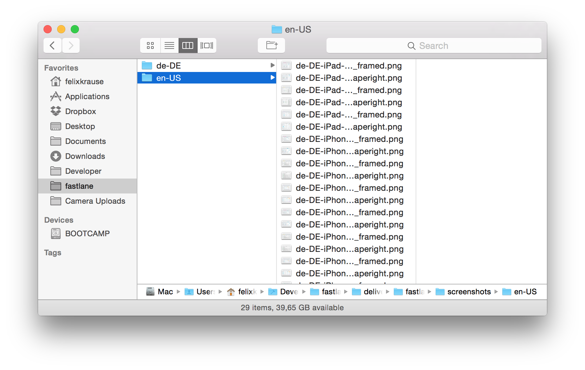
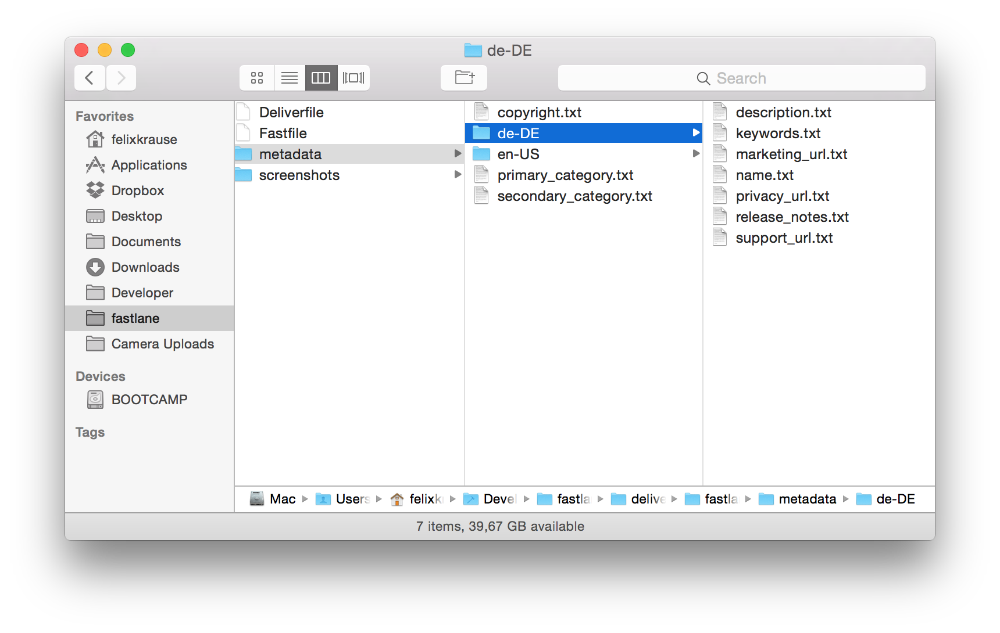

## Available options

All the options below can easily be added to your `Deliverfile`. The great thing: if you use `fastlane` you can use all these options from your `Fastfile` too, for example:

```ruby
deliver(
  submit_for_review: true,
  metadata_path: "../folder"
)
```

##### app_identifier
The bundle identifier (e.g. "com.krausefx.app")

##### username
Your Apple ID email address

##### ipa
A path to a signed ipa file, which will be uploaded. If you don't provide this value, only app metadata will be uploaded. If you want to submit the app for review make sure to either use `deliver --submit_for_review` or add `submit_for_review true` to your `Deliverfile`

```ruby
ipa "App.ipa"
```

if you use [fastlane](https://fastlane.tools) the ipa file will automatically be detected.

##### pkg
A path to a signed pkg file, which will be uploaded. Submission logic of ipa applies to pkg files.
```ruby
pkg "MacApp.pkg"
```

##### app_version

Optional, as it is usually automatically detected. Specify the version that should be created / edited on iTunes Connect:

```ruby
app_version "2.0"
```

##### submit_for_review

Add this to your `Deliverfile` to automatically submit the app for review after uploading metadata/binary. This will select the latest build.

```ruby
submit_for_review true
```

##### screenshots_path
A path to a folder containing subfolders for each language. This will automatically detect the device type based on the image resolution. Also includes  Watch Support.



##### metadata_path
Path to the metadata you want to use. The folder has to be structured like this



If you run `deliver init` this will automatically be created for you.

##### force

```ruby
force true
```
If set to `true`, no HTML report will be generated before the actual upload. You can also pass `--force` when calling `deliver`.


##### price_tier
Pass the price tier as number. This will be active from the current day.
```ruby
price_tier 0
```

##### app_review_information
Contact information for the app review team. Available options: `first_name`, `last_name`, `phone_number`, `email_address`, `demo_user`, `demo_password`, `notes`. 


```ruby
app_review_information(
  first_name: "Felix",
  last_name: "Krause",
  phone_number: "+43 123123123",
  email_address: "github@krausefx.com",
  demo_user: "demoUser",
  demo_password: "demoPass",
  notes: "such notes, very text"
)
```

##### submission_information 
Must be a hash. This is used as the last step for the deployment process, where you define if you use third party content or use encryption. [A list of available options](https://github.com/fastlane/fastlane/blob/master/spaceship/lib/spaceship/tunes/app_submission.rb#L18-L69).

```ruby
submission_information({
  add_id_info_serves_ads: true,
  ...
})
```

##### automatic_release
Should the app be released to all users once Apple approves it? If set to `false`, you'll have to manually release the update once it got approved.

```ruby
automatic_release true
# or 
automatic_release false
```

##### app_rating_config_path
You can set the app age ratings using `deliver`. You'll have to create and store a `JSON` configuration file. Copy the [template](https://github.com/fastlane/fastlane/blob/master/deliver/assets/example_rating_config.json) to your project folder and pass the path to the `JSON` file using the `app_rating_config_path` option. 

The keys/values on the top allow values from 0-2, and the items on the bottom allow only 0 or 1. More information in the [Reference.md](https://github.com/fastlane/fastlane/blob/master/deliver/Reference.md).


## Metadata

All options below are useful if you want to specify certain app metadata in your `Deliverfile` or `Fastfile`

### Localised

Localised values should be set like this

```ruby
description({
  'en-US' => "English Description here",
  'de-DE' => "Deutsche Beschreibung hier"
})
```

##### name
The title/name of the app

##### description
The description of the app

##### release_notes
The release_notes (What's new / Changelog) of the latest version

##### support_url, marketing_url, privacy_url
These URLs are shown in the AppStore

##### keywords

Keywords separated using a comma.

```ruby
keywords(
  "en-US" => "Keyword1, Keyword2"
)
```

##### app_icon
A path to a new app icon, which must be exactly 1024x1024px
```ruby
app_icon './AppIcon.png'
```

##### apple_watch_app_icon
A path to a new app icon for the  Watch, which must be exactly 1024x1024px
```ruby
apple_watch_app_icon './AppleWatchAppIcon.png'
```

### Non-Localised

##### copyright
The up to date copyright information.
```ruby
copyright "#{Time.now.year} Felix Krause"
```

##### primary_category
The english name of the category you want to set (e.g. `Business`, `Books`)

See [Reference.md](https://github.com/fastlane/fastlane/blob/master/deliver/Reference.md) for a list of available categories

##### secondary_category
The english name of the secondary category you want to set

##### primary_first_sub_category
The english name of the primary first sub category you want to set

##### primary_second_sub_category
The english name of the primary second sub category you want to set

##### secondary_first_sub_category
The english name of the secondary first sub category you want to set

##### secondary_second_sub_category
The english name of the secondary second sub category you want to set
